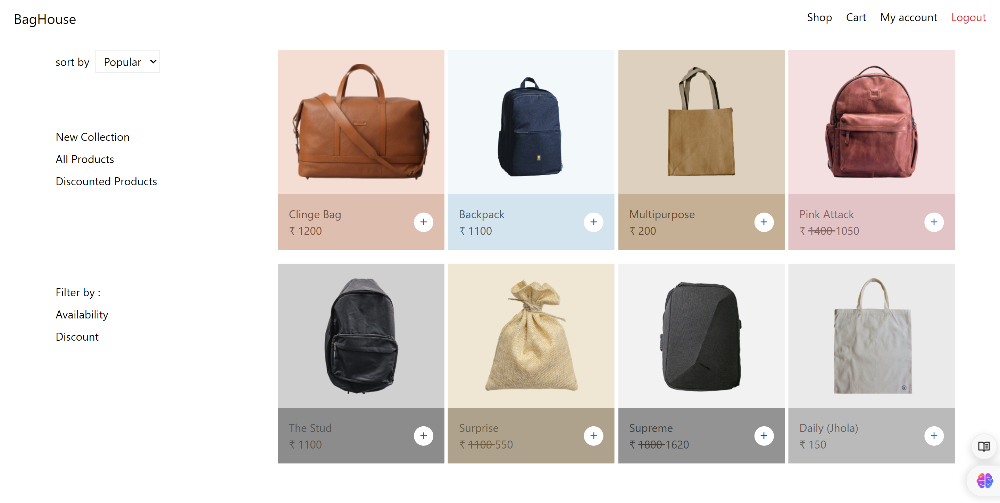

# 👜 bagHouse



bagHouse is a demo e-commerce platform showcasing a variety of bags. Users can browse products, add them to their cart, and simulate the purchasing process. This project is built with Node.js, Express, and MongoDB, implementing user authentication with JWT sessions.

## 🌟 Features

- 🛍️ Browse a collection of demo bags
- 🛒 Add products to cart
- 👤 User authentication system
- 🔐 JWT session management
- 🏗️ Follows separation of concerns for organized code structure

## 🚧 Project Status

**Note:** This project is currently under development and not yet fully completed.

## 🛠️ Technologies Used

- Node.js
- Express.js
- EJS (Embedded JavaScript templating)
- MongoDB
- JWT (JSON Web Tokens)
- Crypto (for password hashing)
- Multer (for file uploading)

## 🚀 Getting Started

### Prerequisites

- Node.js (v14+ recommended)
- MongoDB

### Installation

1. Clone the repository:
   ```
   git clone https://github.com/Chetan3010/bagHouse.git
   cd bagHouse
   ```

2. Install dependencies:
   ```
   npm install
   ```

3. Set up environment variables:
   Create a `.env` file in the root directory and add the following:
   ```
   MONGODB_URL=your_mongodb_connection_string
   JWT_SECRET=your_jwt_secret_key
   EXPRESS_SECRET=your_express_secret
   ```

4. Start the server:
   ```
   npm start
   ```

Visit `http://localhost:3007` in your browser to see the application running.

## 📁 Project Structure

The project follows a separation of concerns principle:

```
bagHouse/
│
├── config/         # Configuration files
├── controllers/    # Request handlers
├── models/         # Database models
├── routes/         # Route definitions
├── middleware/     # Custom middleware
├── views/          # EJS templates
├── public/         # Static files (CSS, client-side JS)
├── utils/          # Utility functions
└── app.js          # Entry point
```

## 📚 Usage

1. Register a new account or log in
2. Browse the available bags
3. Add desired items to your cart
4. Proceed to checkout (demo only, no actual purchase)

## 🔐 Authentication

- User registration and login system
- JWT-based session management
- Secured routes for authenticated users

Project Link: [https://github.com/Chetan3010/bagHouse](https://github.com/Chetan3010/bagHouse)
